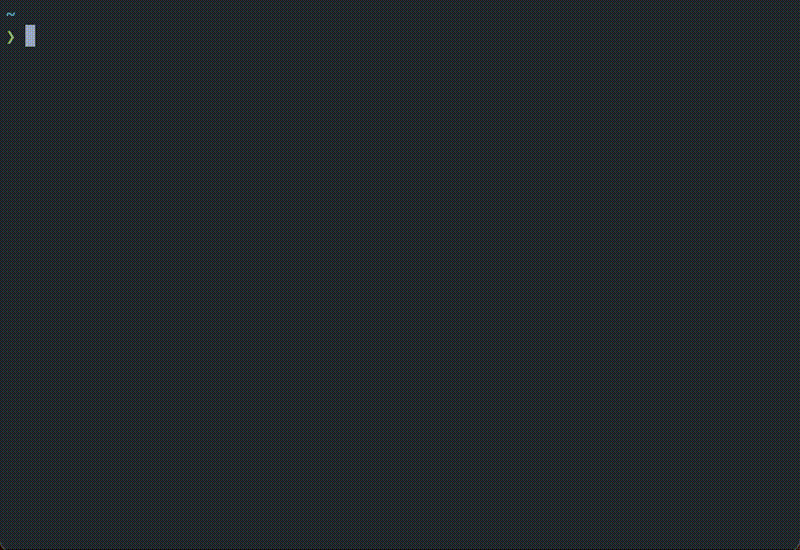

# `shellmark`: bookmark manager for shell



> THIS IS AN EARLY ALPHA. It works for me, but requires better UX and more polish.

`shellmark` is a cross-platform bookmark mananger for your shell. 
The main features are:
1. `shellmark add` to bookmark directories and files.
2. `shellmark browse` to interactively search and act on bookmarks.

Use `ctrl+k` on selected bookmark to delete it. (shellmark browse)

## Installation instructions

### From source

Make sure you have Rust toolchain set up (1.49+ should work). Then run the following commands:

```bash
$ git clone https://github.com/artempyanykh/shellmark.git
$ cd shellmark
$ cargo install --path .
```
This will install `shellmark` under `~/.cargo/bin`.

## Integration with shell

### Bash/Zsh

```
if type shellmark &>/dev/null; then
    eval "$(shellmark --out posix plug)"
fi
```

### Fish

```
if type -q shellmark
    shellmark --out fish plug | source
end
```

### PowerShell

```
if (Get-Command shellmark -ErrorAction SilentlyContinue) {
    Invoke-Expression (@(&shellmark --out powershell plug) -join "`n")
}
```
