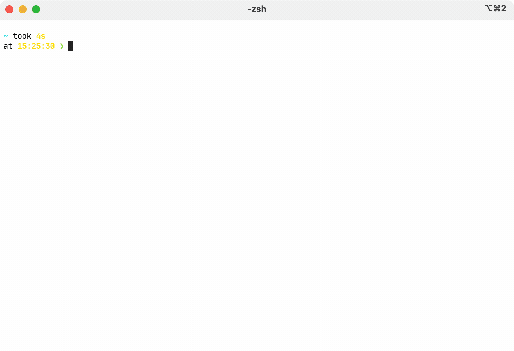

# `shellmark`: bookmark manager for shell

[](https://github.com/artempyanykh/shellmark/actions/workflows/push.yml)



`shellmark` is a cross-platform bookmark mananger for your shell. 
The main features are:
1. `shellmark add` to bookmark directories and files.
2. `shellmark browse` to interactively search and act on bookmarks.

Use `ctrl+k` on selected bookmark to delete it. (shellmark browse)

## Installation instructions

### Pre-built binary

1. Go to [Releases](https://github.com/artempyanykh/shellmark/releases) page
   and download the binary for your OS.
2. Rename the binary to remove the OS suffix, so it becomes just `shellmark`
   or `shellmark.exe`.
3. Drop the binary somewhere in your `PATH`.

### From source

Make sure you have Rust toolchain set up (1.49+ should work). Then run the following commands:

```bash
$ git clone https://github.com/artempyanykh/shellmark.git
$ cd shellmark
$ cargo install --path .
```
This will install `shellmark` under `~/.cargo/bin`.

## Integration with shell

### Bash/Zsh

```
if type shellmark &>/dev/null; then
    eval "$(shellmark --out posix plug)"
fi
```

### Fish

```
if type -q shellmark
    shellmark --out fish plug | source
end
```

### PowerShell

```
if (Get-Command shellmark -ErrorAction SilentlyContinue) {
    Invoke-Expression (@(&shellmark --out powershell plug) -join "`n")
}
```
